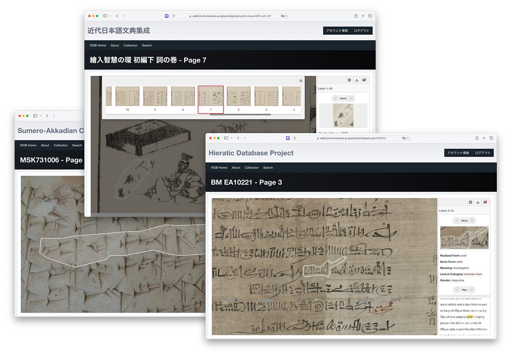

# WDB: Word-Database Module for Drupal

> Documentation note: A full Japanese explanation is provided in the latter half of this file. / 後半に日本語での詳細説明があります。

## 1. Overview

The Word-Database (WDB) Core module is a comprehensive toolkit for Drupal designed for linguists, historians, philologists, and digital humanists. A key feature of WDB is its flexibility, allowing for the management of **multiple linguistic materials from various eras and regions on a single, unified platform.**

At its core, the system allows users to perform granular annotations on high-resolution IIIF-compliant images, linking individual characters (signs) and words to detailed linguistic information. This deep data structure enables powerful searches, allowing users to **query textual information directly from the image context**. It features a rich user interface based on OpenSeadragon and Annotorious v3, a robust data import workflow, and deep integration with Drupal's core systems.

WDB is designed to transform digital image archives into structured, searchable, and interoperable linguistic databases, ready for scholarly research and public engagement.

## Screenshots



## 2. Features

- **IIIF-Compliant Viewer & Editor:** A powerful and intuitive interface for viewing and annotating high-resolution images, built with OpenSeadragon and Annotorious v3.
- **Granular Annotation:** Supports detailed polygon annotations for individual characters (signs). **Word polygons are automatically calculated from these character sets**, enabling precise linguistic analysis.
- **Flexible Linguistic Data Import:** A batch import system for linguistic data using TSV files, complete with a rollback feature for safe data management.
- **Template Generation:** Automatically generate TSV templates from morphological analysis results (currently supporting **Japanese formats like WebChaMaMe's "Chaki import format"**) or from existing data within the system, significantly lowering the barrier to entry.
- **Dynamic Configuration & Access Control:** Manage all module and subsystem settings through a unified administrative UI. Configure whether to **make gallery and search pages public to anonymous users**, or **restrict access to members of a specific Drupal Group** for each collection.
- **IIIF Presentation API v3 Compliant:** Automatically generates IIIF Presentation API v3 manifests, including word-level annotations with rich, linked-data-ready descriptions, ensuring interoperability with external viewers like Mirador 3.
- **Customizable Data Export:** Export linguistic data in **TEI/XML and RDF/XML formats**. **Templates for these formats can be edited directly within the administrative UI**, allowing for user-defined output structures.
- **Deep Views Integration:** Full integration with Drupal's Views module allows site administrators to create completely customized search result pages and data listings without writing any code.
- **Extensible Entity Structure:** Built on Drupal's standard entity system. Site administrators can easily **add new fields to core data types like 'Source' and customize their display**, just like any other content type.
- **Optional Cantaloupe Integration:** An optional submodule provides a secure API endpoint to integrate with a Cantaloupe IIIF Image Server's delegate script, enabling control over **IIIF image access based on the user's login status on the Drupal site**.

## 3. Requirements

- **Drupal Core:** `^10` or `^11`
- **PHP:** `^8.1`
- **Required Drupal Modules (Enabled automatically by** `wdb_core.info.yml`**):**
  - Taxonomy, Content Translation, Language
  - File, Image
  - Field, Field UI
  - jQuery UI, jQuery UI Dialog
  - Group
- **Optional:**
  - **IIIF Image Server (Cantaloupe recommended)** (for serving your own images)

## 4. Installation

1. Navigate to your Drupal project's root directory.
2. Place the module directory in `/modules/custom`. *(Once published on Drupal.org, it can be installed via `composer require drupal/wdb_core`)*.
3. Enable the main module and any desired sub-modules via the Drupal UI (`/admin/modules`) or Drush:
```bash
   # Enable the core module (required)
   drush en wdb_core

   # Enable optional sub-modules as needed
   drush en wdb_core_views      # For Views integration
   drush en wdb_cantaloupe_auth # For Cantaloupe authentication
   drush en wdb_example         # For sample content
```
4. **Configure Private File System:** The linguistic data import feature requires Drupal's private file system.
   - Go to `Configuration > Media > File system` (`/admin/config/media/file-system`).
   - Set the "Private file system path" (e.g., `../private`) and save the configuration. Ensure this directory exists and is writable by the web server, but is not accessible directly from the web.
5. **Upon installation, the module will automatically:**
   - Add English and Japanese languages to the site if they do not exist.
   - Create the necessary Taxonomy vocabularies (Lexical Category, Grammatical Categories, etc.).
   - Create a default set of POS (Part-of-Speech) mapping rules.
6. Navigate to `/admin/people/permissions` and grant the "Administer WDB Core configuration" and other WDB-related permissions to the appropriate roles.

## 5. Usage Workflow

After installation, all WDB-related management pages are consolidated under the **WDB** menu item in the administration toolbar. Here is a typical workflow for setting up and using the system:

1. **Create a Subsystem:**
   - **Prerequisite:** Ensure the language for your data is available in Drupal. Go to `Configuration > Regional and language > Languages` (`/admin/config/regional/language`). If the language (e.g., Egyptian) does not exist, add it as a "Custom language".
   - **Create the Term:** Go to `Structure > Taxonomy > Subsystem` and create a new taxonomy term for your collection. Select the language for this subsystem.
2. **Configure the Subsystem:** Go to `WDB > Dashboard > Configuration > Module Settings`. In the tab for your new subsystem, configure the IIIF server details and access control settings.
   - **Important:** It is recommended to set the **IIIF Identifier Pattern** at this stage, before creating any `WDB Source` entities. This ensures that `image_identifier` values are generated correctly from the start. If you want to modify the `image_identifier` after creating the `WDB Source` entity (i.e., after the annotation page entity has been automatically created), enter the **IIIF Identifier Pattern** and click the **Apply pattern to existing pages in "{subsystem_name}"** button in the **Update Existing Pages** section.
  - **Identifier template syntax:** Available placeholders are `{source_identifier}`, `{page_number}`, `{page_name}`, and `{subsystem_name}`. You can append filters such as `{source_identifier|substr:0:8}` or `{source_identifier|substr:-4}` to extract slices (arguments follow PHP's `substr`: start plus an optional length, negative values allowed).
   - **IIIF Server Prefix:** Do not URL-encode this value.
   - **Allow anonymous access:** Check this to make the gallery and search pages for this subsystem public. Otherwise, users will need the "View non-public WDB gallery pages" or "Access WDB search form" permissions, respectively.
   - **Restrict via Drupal Group:** Optionally select a Drupal Group to limit access to its members. If the Group module is not installed, you can manually enter a Group UUID.
   - **Hull Concavity:** Controls the tightness of the auto-generated word polygon. A smaller value creates a tighter, more concave shape. However, `0` results in a convex hull.
3. **Define a Source:** Go to `WDB > Dashboard > Content Management > Manage Sources` and create a new `WDB Source` entity. Select the subsystem you just created.
4. **Update Annotation Pages:** When a new Source is created, Annotation Page entities are automatically generated based on the "Pages" field. Navigate to `WDB > Dashboard > Content Management > Manage Annotation Pages` to edit these pages and confirm the `image_identifier` has been generated correctly. You can also manually override it here if needed.
5. **View the Gallery:** At this point, you should be able to access the gallery page (`/wdb/{subsystem_name}/gallery/{source_identifier}/{page_number}`) and see the IIIF images.
6. **Annotate Characters:** In edit mode (`./edit`), draw polygons for each character. Enter a label for each polygon in the popup editor (e.g., a format like "line-character_sequence" like "1-1", "1-2" is recommended, but any readable text is acceptable).
7. **Prepare Linguistic Data:** Create your linguistic data in a TSV file. You can download a template from the "TSV Template Generator" tool (`WDB > Dashboard > Tools & Utilities`). The `example` module provides useful sample data. For Japanese, you can also generate a template directly from the output of a morphological analyzer like WebChaMaMe (Chaki import format). In that case, UniDic's part-of-speech system will be automatically mapped to WDB's lexical categories. The POS Mappings table is used for mapping. You can also modify the mapping as needed.
8. **Import Data:** Go to the Import Form (`WDB > Dashboard > Tools & Utilities > Import New Data`), select the language, upload your TSV file, and start the batch import.
9. **Verify:** Check the gallery page again. The linguistic data should now be displayed in the annotation panel, linked to the character polygons on the viewer.

## 6. Displaying Subsystem Titles

To display a prominent title for each subsystem (e.g., "Genji Monogatari Database") independently of the main site name, WDB Core provides a dedicated block. This is the recommended way to show visitors which collection they are currently viewing.

1. **Set the Title:** Go to `WDB > Dashboard > Configuration > Module Settings`. In each subsystem's tab, fill in the **Display Title** field with the full title you want to show for that collection.
2. **Place the Block:** Go to `Structure > Block layout` (`/admin/structure/block`). Click **Place block** in the region where you want the title to appear (e.g., Header or Content).
3. **Select the Block:** In the modal window, find and place the **WDB Subsystem Title** block.
4. **Configure the Block:** Uncheck the "Display title" option in the block's configuration form to prevent the block label from appearing.
5. **Theme Integration (Recommended):** For the best user experience, it is recommended to hide the default site name in your theme's settings and use this block as the primary title on WDB pages. The block will only appear on pages that belong to a subsystem, so it will not interfere with other parts of your site.

## 7. TSV File Format

The following columns are expected in the data import file. Fields marked with \* are mandatory.

- `source`\*: The "Source Identifier" of the WdbSource entity.
- `page`\*: The page number.
- `labelname`\*: The label text entered for each polygon (e.g., "1-1").
- `sign`\*: The character symbol or code.
- `function`: The function of the character (e.g., phonogram, logogram).
- `phone`: The phonetic transcription of the character.
- `note`: A note about the character.
- `word_unit`\*: A numeric value to group characters into a word. All characters in the same word should have the same number. This value must be unique across the entire source document.
- `basic_form`\*: The lemma (dictionary form) of the word. A word is considered unique by the combination of its basic form and lexical category.
- `realized_form`: The actual form of the word as it appears in the text.
- `word_sequence`\*: The sequence number of the word in the document. This value must be unique across the entire source document.
- `lexical_category_name`\*: The part-of-speech name for the word. If a matching term does not exist in the "Lexical Category" taxonomy, a new one will be created.
- `meaning`\*: A numeric value to distinguish between multiple meanings of the same word.
- `explanation`: A description or gloss for the meaning.
- `verbal_form_name`, `gender_name`, `number_name`, `person_name`, `voice_name`, `aspect_name`, `mood_name`, `grammatical_case_name`: Names of grammatical categories. If a matching term does not exist in the corresponding taxonomy, a new one will be created.

## 8. Advanced Topics

### Cantaloupe IIIF Server Integration

The optional `wdb_cantaloupe_auth` submodule now ships with a signed token workflow that keeps IIIF tiles working even on browsers that block third-party cookies (Safari, Firefox strict mode, etc.). The legacy cookie-based fallback is still in place for logged-in sessions, so existing viewers continue to work during the transition.

#### Token-based authorization flow

1. When Drupal renders a gallery/editor page, `WdbDataService` issues a short-lived token via `wdb_cantaloupe_auth.token_manager` and exposes it in `drupalSettings.wdb_core.openseadragon.auth`.
2. Every IIIF URL (info.json, tiles, thumbnails) is rewritten with a query parameter such as `?wdb_token=…` using that token.
3. Your reverse proxy forwards the original request URI and token to Cantaloupe via headers (`X-Original-URI`, `X-Original-URL`, `X-Wdb-Token`, etc.).
4. The Cantaloupe delegate script (see below) extracts the token/cookies, calls Drupal’s `/wdb/api/cantaloupe_auth` endpoint, and passes along the identifier.
5. Drupal validates the signature, expiration, and optional Drupal Group membership before returning `{"authorized": true/false}`. If no token is present it falls back to the historical cookie/session lookup so logged-in editors can still access tiles even before the token helper loads.

The default TTL is 600 seconds. After a user logs out, previously issued IIIF URLs continue to work until their token expires; shorten `token_ttl` if you need a stricter window. Logged-in editors remain authorized even if a token expires mid-session because the delegate falls back to their Drupal session cookies, so aggressive TTL values only impact anonymous/public traffic. The viewer also refreshes its token in the background while a page stays open, which lets you safely experiment with single-digit TTLs for anonymous users without booting active editors.

#### Drupal-side configuration

- Enable the submodule: `drush en wdb_cantaloupe_auth`.
- Configure each subsystem at `/admin/config/wdb/settings`:
  - Uncheck **Allow anonymous access** to require either a token or Drupal permissions.
  - Optionally select a Drupal Group in **Restrict via Drupal Group** (stored as UUID) to limit access to group members. If the Group module is not installed, you can paste a UUID instead.
- Token service settings live in `wdb_cantaloupe_auth.settings`. Adjust them via **WDB > Dashboard > Configuration > Cantaloupe authentication** (`/admin/config/wdb/cantaloupe-auth`) or Drush:

```bash
drush cget wdb_cantaloupe_auth.settings
drush cset wdb_cantaloupe_auth.settings token_ttl 600 -y
drush cset wdb_cantaloupe_auth.settings token_param wdb_token -y
```

Clear Drupal caches after changing the identifier pattern or access policy.

#### Reverse proxy requirements

Whatever sits in front of Cantaloupe (nginx, Apache, CDN, etc.) must forward the original IIIF URI plus the extracted query string, otherwise the delegate will never see `wdb_token`. At minimum set the following headers:

```nginx
location ^~ /iiif/ {
  proxy_pass http://cantaloupe:8182;
  proxy_set_header Host $host;
  proxy_set_header X-Forwarded-Proto $scheme;
  proxy_set_header X-Forwarded-Host $host;
  proxy_set_header X-Forwarded-Port $server_port;
  proxy_set_header X-Forwarded-For $proxy_add_x_forwarded_for;
  proxy_set_header X-Original-URI $request_uri;
  proxy_set_header X-Original-URL $scheme://$host$request_uri;
  proxy_set_header X-Wdb-Token $arg_wdb_token;
}
```

For Apache/mod_proxy the equivalent looks like:

```apacheconf
ProxyPass        /iiif/  http://cantaloupe.internal:8182/iiif/ timeout=600 keepalive=On
ProxyPassReverse /iiif/  http://cantaloupe.internal:8182/iiif/

RequestHeader set X-Forwarded-Proto "https"
RequestHeader set X-Forwarded-Host  "%{HTTP_HOST}s"
RequestHeader set X-Forwarded-Port  "%{SERVER_PORT}s"
RequestHeader set X-Forwarded-For   "%{REMOTE_ADDR}s"
RequestHeader set X-Original-URI    "%{REQUEST_URI}s"
RequestHeader set X-Original-URL    "https://%{HTTP_HOST}s%{REQUEST_URI}s"
SetEnvIfExpr "req_query('wdb_token') =~ /.+/" wdb_token_qs=$0
RequestHeader set X-Wdb-Token "%{wdb_token_qs}e"
```

Adjust the upstream host/port to match your deployment (Docker service name, UNIX socket, load balancer, etc.).

#### Delegate script & local harness

- A sample delegate script is provided at `web/modules/custom/wdb_core/modules/wdb_cantaloupe_auth/scripts/delegate.rb`. It shows how to extract the token from `request_uri`, `request_headers`, and forwarded headers. Copy it into your Cantaloupe deployment (as `delegate.rb` or `require_relative` from your existing delegate) and set `DRUPAL_AUTH_ENDPOINT`.
- Set `DRUPAL_AUTH_ENDPOINT` to the internal address of `/wdb/api/cantaloupe_auth`. You can optionally override the query parameter name by exporting `WDB_TOKEN_PARAM`.
- A CLI harness (`web/modules/custom/wdb_core/modules/wdb_cantaloupe_auth/scripts/delegate_harness.rb`) lets you test the flow without running Cantaloupe:

```bash
DRUPAL_AUTH_ENDPOINT="https://wdb.example.org/wdb/api/cantaloupe_auth" \
  ruby delegate_harness.rb \
  --identifier wdb/hdb/bm10221/1.ptif \
  --request-uri "/iiif/3/.../default.jpg?wdb_token=<paste token>"
```

#### Verification & troubleshooting

- Cantaloupe writes detailed logs to `cantaloupe/logs/application.log`. A healthy request shows `:token=>"[redacted]"` in the payload and `{"authorized":true,"reason":"Token validated."}` from Drupal.
- If you only see `"reason":"No session cookie found."`, the token is not reaching the delegate—revisit your proxy headers.
- Tokens remain valid until the configured TTL. This is why an already-open tile URL still works for a few minutes after logout, whereas a bare (no-token) URL immediately returns 403 once the Drupal session ends.
- Logged-in editors can still access IIIF URLs without tokens because the delegate falls back to session cookies. Disable that fallback only if you are ready to enforce tokens everywhere.
### **Export Template Variables**

The TEI/XML and RDF/XML export templates are rendered using Twig. The main data object available in the template is `page_data`. Below is a guide to its structure and the available variables.

* `page_data`
  * `.source`: The `WdbSource` entity object for the current document.
    * `{{ page_data.source.label() }}`: The display name of the source.
    * `{{ page_data.source.source_identifier.value }}`: The unique identifier of the source.
    * `{{ page_data.source.description.value }}`: The description of the source.
  * `.page`: The `WdbAnnotationPage` entity object for the current page.
    * `{{ page_data.page.label() }}`: The display label of the page (e.g., "p. 3").
    * `{{ page_data.page.page_number.value }}`: The page number.
    * `{{ page_data.page.getCanvasUri() }}`: A helper method to get the full IIIF Canvas URI for the page.
  * `.word_units`: An array of all word units on the page, sorted by their sequence. You can loop through this array:
    ```
    
      ...
    `
    ```
    Each `item` in the loop contains:
    * `item.entity`: The `WdbWordUnit` entity object.
      * `{{ item.entity.realized_form.value }}`: The realized form.
      * `{{ item.entity.word_sequence.value }}`: The sequence number.
      * To access related data, you can traverse the entity references:
        * ``
        * ``
        * `{{ word.basic_form.value }}`
        * `{{ word.lexical_category_ref.entity.label() }}`
    * `item.sign_interpretations`: An array of `WdbSignInterpretation` entities that make up this word unit, sorted by their sequence within the word.
      * ``
      * `{{ si.phone.value }}`
      * ``
      * ``
      * `{{ sign.sign_code.value }}`


## **9\. For Developers**

### **Entity Relationships**

The WDB module is built upon a rich set of custom content entities. The primary relationships are as follows:

* **WdbSource** (A document) has many **WdbAnnotationPage**s.
* **WdbWordUnit** (A word in context) appears on one or more **WdbAnnotationPage**s.
* **WdbWordUnit** is linked to a single **WdbWordMeaning**.
* **WdbWordMeaning** belongs to a single **WdbWord** (the lemma).
* **WdbWord** is classified by a **Lexical Category** (Taxonomy Term).
* **WdbWordUnit** is composed of one or more **WdbSignInterpretation**s, linked via the **WdbWordMap** entity.
* **WdbSignInterpretation** is linked to a **WdbLabel** (the annotation polygon) and a **WdbSignFunction**.
* **WdbSignFunction** belongs to a single **WdbSign** (the character).

### **Design Notes**

*Optional Sign Function Name*

`WdbSignFunction.function_name` is intentionally optional. If it is left blank the generated `sign_function_code` becomes `<sign_code>_` (a trailing underscore). Two safeguards enforce logical uniqueness:

1. A composite uniqueness validator on `(langcode, sign_ref, function_name)` treats an empty string as a real value so duplicate blank entries for the same Sign + language are rejected before hitting the database.
2. An additional validator step predicts the final `sign_function_code` and blocks duplicates (relevant when `function_name` is blank or identical).

Rationale: During early data creation and TSV preparation, researchers (often in the humanities rather than computational specialists) may not yet wish to categorise every sign function. Allowing an empty value lowers friction while still guaranteeing stable identifiers and preventing silent duplication. This is analogous—but not identical—to `WdbWordMeaning`, where `meaning_identifier` is required but `explanation` is optional.

If a future project phase requires making the function name mandatory, it can be flipped to required without breaking existing codes; existing blank entries already yield consistent `sign_function_code` values.

### **Key Services**

* `wdb_core.data_service` **(**WdbDataService**):** A central service for fetching and structuring data for the annotation panel and other parts of the system.
* `wdb_core.data_importer` **(**WdbDataImporterService**):** Handles the logic for parsing TSV files and creating/updating entities in batch.
* `wdb_core.template_generator` **(**WdbTemplateGeneratorService**):** Contains the logic for generating TSV templates.

## 1. 概要

Word-Database (WDB) Core モジュールは、言語学者、歴史学者、文献学者、そしてデジタル・ヒューマニティーズの研究者のために設計された、Drupal のための包括的なツールキットです。WDB の最も重要な特徴は、その柔軟性です。さまざまな時代や地域の複数の言語資料を、単一の統一されたプラットフォーム上で取り扱うことができます。

このシステムの中核となるのは、IIIF に準拠した高精細画像に対して詳細なアノテーションを付与し、個々の文字（sign）や単語（word）を、詳細な言語情報と結びつける機能です。この深いデータ構造により、画像上の文脈から直接テキスト情報を検索する、といった強力な検索が可能になります。OpenSeadragon と Annotorious v3 をベースにしたリッチなユーザーインターフェース、堅牢なデータ投入ワークフロー、そして Drupal のコアシステムとの深い統合を特徴としています。

WDB は、デジタル化された画像アーカイブを、学術研究と公開活用のための、構造化され、検索可能で、相互運用性の高い言語データベースへと変換するために設計されています。

## スクリーンショット


## 2. 主な機能

- **IIIF準拠のビューアとエディタ:** OpenSeadragon と Annotorious v3 で構築された、高精細画像の閲覧とアノテーション付与のための強力で直感的なインターフェース。
- **詳細なアノテーション機能:** 個々の文字（sign）に対するポリゴン形式でのアノテーションをサポート。**単語のポリゴンは、これらの文字の集合から自動的に計算され**、精密な言語分析を可能にします。
- **柔軟な言語データ投入:** TSV ファイルを用いた言語データ一括投入システム。安全なデータ管理のためのロールバック機能も完備。
- **テンプレート生成機能:** 形態素解析結果（現在は **Web茶まめ の「Chaki インポート形式」等の日本語フォーマットに対応**）や、システム内の既存データから、TSV テンプレートを自動生成。導入のハードルを大幅に下げます。
- **動的な設定とアクセス制御:** モジュールとサブシステム（資料群）の全設定を統一された管理画面から操作可能。資料群ごとに、**匿名ユーザーへの公開**や、**特定の Drupal Group メンバーへのアクセス制限**を設定できます。
- **IIIF Presentation API v3 準拠:** 単語レベルのアノテーション（豊富なリンク情報付き）を含む IIIF Presentation API v3 準拠のマニフェストを自動生成し、Mirador 3 など外部ビューアとの相互運用性を保証します。
- **カスタマイズ可能なデータエクスポート:** 言語データを **TEI/XML および RDF/XML 形式**でエクスポート可能。**これらのフォーマットのテンプレートは管理画面から直接編集でき**、ユーザーが自由に出力構造を定義できます。
- **Views との深い連携:** Drupal の Views モジュールと完全に統合。検索結果や一覧ページをコード不要で柔軟に構築できます。
- **拡張可能なエンティティ構造:** Drupal の標準エンティティシステムに準拠。例えば「資料（Source）」などの中心的なデータ型に**フィールドを追加し、表示をカスタマイズ可能**です。
- **Cantaloupe 連携（オプション）:** Cantaloupe IIIF 画像サーバの Delegate スクリプトと連携する安全な API を提供し、**Drupal 側のログイン状態に応じた IIIF 画像アクセス制御**を実現します。

## 3. 要件

- **Drupal Core:** `^10` または `^11`
- **PHP:** `^8.1`
- **必須 Drupal モジュール（**`wdb_core.info.yml` **により自動有効化）:**
  - Taxonomy, Content Translation, Language
  - File, Image
  - Field, Field UI
  - jQuery UI, jQuery UI Dialog
  - Group
- **オプション:**
  - **IIIF 画像サーバ（Cantaloupe 推奨）**

## 4. インストール

1. Drupalプロジェクトのルートディレクトリに移動します。
2. モジュールディレクトリを `/modules/custom` に配置してください。（将来的にDrupal.orgで公開された場合は `composer require drupal/wdb_core` でインストールできます。）
3. Drupalの管理画面（`/admin/modules`）またはDrushを使って、メインモジュールと、必要に応じてサブモジュールを有効化します:
```bash
   # コアモジュールを有効化（必須）
   drush en wdb_core

   # 必要に応じてオプションのサブモジュールを有効化
   drush en wdb_core_views      # Views連携機能
   drush en wdb_cantaloupe_auth # Cantaloupe認証連携
   drush en wdb_example         # サンプルコンテンツ
```
4. **プライベートファイルシステムの設定:** 言語データのインポート機能は、Drupalのプライベートファイルシステムを使用します。
   - `環境設定 > メディア > ファイルシステム` (`/admin/config/media/file-system`) に移動します。
   - 「プライベートファイルシステムパス」を設定し（例: `../private`）、設定を保存してください。このディレクトリは、Webサーバーから書き込み可能で、かつWebから直接アクセスできない場所にある必要があります。
5. **インストール時の挙動:** モジュールを有効化すると、以下の初期設定が自動的に行われます。
   - サイトに英語と日本語が（もしなければ）追加されます。
   - 語彙範疇（Lexical Category）や文法カテゴリー（Grammatical Categories）のタクソノミーボキャブラリーが生成されます。
   - 品詞マッピングの初期ルールが作成されます。
6. `/admin/people/permissions` に移動し、「Administer WDB Core configuration」や、その他のWDB関連の権限を、適切な役割（ロール）に割り当ててください。

## 5. 使い方：基本的なワークフロー

インストール後、WDB関連の全ての管理ページは、管理ツールバーの **WDB** メニュー項目に集約されます。以下に、典型的な作業の流れを示します。

1. **サブシステムの作成:**
   - **事前準備:** 扱うデータの言語がDrupalに登録されていることを確認します。`環境設定 > 地域・言語 > 言語` (`/admin/config/regional/language`) に移動してください。もし言語（例: エジプト語）が存在しない場合は、「カスタム言語を追加」から言語コード（例: egy）を指定して作成します。
   - **タームの作成:** `サイト構築 > タクソノミー > Subsystem` に移動し、資料群に対応する新しいタクソノミータームを作成します。この時、その資料群の主要言語として、先ほど準備した言語を選択します。
2. **サブシステムの設定:** `WDB > ダッシュボード > 設定 > モジュール設定` に移動します。新しく作成したサブシステムのタブを開き、IIIF画像サーバの情報や資料の公開方法などを設定します。
   - **重要:** `image_identifier`を正しく自動生成するために、この段階で **IIIF Identifier Pattern** を設定することを推奨します。この設定は、`WDB Source` **エンティティを作成する前**に行ってください。`WDB Source`エンティティ作成後（すなわちアノテーションページエンティティが自動作成された後）に`image_identifier`を修正したい場合には、**IIIF Identifier Pattern**を入力した上で、**Update Existing Pages**セクションの **Apply pattern to existing pages in {subsystem_name}** ボタンをクリックしてください。
  - **識別子テンプレート構文:** 利用できるプレースホルダーは `{source_identifier}`、`{page_number}`、`{page_name}`、`{subsystem_name}` です。さらに `{source_identifier|substr:0:8}` や `{source_identifier|substr:-4}` のように `|substr` フィルタを付与して部分文字列を抽出できます（引数は PHP の `substr` と同じで、開始位置＋任意の長さ。負の値も使用可能）。
   - **IIIF Server Prefix:** URLエンコードは不要です。
   - **Allow anonymous access:** これにチェックを入れると、このサブシステムのギャラリーページと検索フォームが匿名ユーザーに公開されます。チェックを外した場合、それぞれ「View non-public WDB gallery pages」または「Access WDB search form」の権限が必要になります。初期状態では非公開です。
   - **Restrict via Drupal Group:** 特定の Drupal Group のメンバーのみにアクセスを制限したい場合に選択します。Group モジュールがインストールされていない場合は、Group UUID を直接入力することも可能です。
   - **Hull Concavity:** 文字の集合から単語のポリゴンを生成する際の、座標の密着度（凹みの大きさ）を制御します。値が小さいほど凹みが大きくなります（ただし、0で凸包）。
3. **資料情報の定義:** `WDB > ダッシュボード > コンテンツ管理 > 資料の管理` に移動し、新しい `WDB Source` エンティティを作成します。先ほど作成したサブシステムを選択してください。
4. **アノテーションページの更新:** 新しい資料を作成すると、そのページ数分のアノテーションページエンティティが自動生成されます。`WDB > ダッシュボード > コンテンツ管理 > アノテーションページの管理` に移動し、`image_identifier`が正しく生成されていることを確認します。必要であれば、ここで個別に値を上書きすることも可能です。
5. **ギャラリーページの確認:** ここまでの設定が完了すると、`/wdb/{サブシステム名}/gallery/{資料ID}/{ページ番号}` というURLでギャラリーページにアクセスし、IIIF画像が表示されるはずです。
6. **アノテーションの作成:** 編集モード (`./edit`) に切り替え、ツールバーのボタンを使ってポリゴンを描画します。各ポリゴンには、"1-1"（行番号-文字順）のような、ページ内でユニークなラベル名を入力します。
7. **言語データの準備:** システム外で言語データを作成します。`WDB > ダッシュボード > ツールとユーティリティ > TSVテンプレート生成` から、テンプレートとなるTSVファイルをダウンロードできます。`example`モジュールを有効化すると、サンプルデータも利用できます。日本語の場合は、形態素解析済みテキスト（Web茶まめが出力するChakiインポート用形式のフォーマット）をアップロードして、テンプレートを生成することも可能です。その場合、UniDicの品詞体系はWDBの語彙範疇に自動的にマッピングされます。マッピングにはPOS Mappingsテーブルが使われます。必要に応じてマッピングを修正することも可能です。
8. **言語データの投入:** `WDB > ダッシュボード > ツールとユーティリティ > データ新規取込` フォームで、作成したTSVファイルをアップロードします。
9. **最終確認:** 再度ギャラリーページにアクセスし、ポリゴンと言語データが正しく結びついて表示されることを確認します。

## 6. サブシステム・タイトルの表示

各サブシステム（資料群）のタイトル（例: 「源氏物語データベース」）を、サイト全体のサイト名とは独立して表示するために、WDB Coreは専用のブロックを提供します。これは、訪問者に現在どの資料群を閲覧しているかを伝えるための推奨される方法です。

1. **タイトルの設定:** `WDB > ダッシュボード > 設定 > モジュール設定` に移動します。各サブシステムのタブで、**Display Title** フィールドに、その資料群で表示したい正式なタイトルを入力します。
2. **ブロックの配置:** `サイト構築 > ブロックレイアウト` (`/admin/structure/block`) に移動します。タイトルを表示したい領域（例: ヘッダーやコンテンツ）の **ブロックを配置** ボタンをクリックします。
3. **ブロックの選択:** モーダルウィンドウで **WDB Subsystem Title** ブロックを探し、配置します。
4. **ブロックの設定:** ブロックの設定フォームで、「タイトルを表示」のチェックを外すと、ブロックのラベルが表示されず、`<h1>`タグで囲まれたタイトルだけが表示されるため、すっきりとします。
5. **テーマとの連携（推奨）:** 最適なユーザー体験のためには、テーマの設定でデフォルトのサイト名を非表示にし、このブロックをWDB関連ページのメインタイトルとして使用することをお勧めします。このブロックは、サブシステムに属するページでのみ表示されるため、サイトの他の部分には影響を与えません。

## 7. TSVファイルの各カラムの書式について

データ投入用のTSVファイルは、以下のカラムで構成されます。\* が付いている項目は必須です。

- `source`\*: 資料名。WdbSourceエンティティの「Source Identifier」と一致させる必要があります。
- `page`\*: ページ番号。
- `labelname`\*: ラベル名。各ポリゴンに入力した "1-1" 等のテキストと一致させる必要があります。
- `sign`\*: 文字記号あるいは文字コード。
- `function`: 文字の機能（例: phonogram, logogram）。
- `phone`: 文字の発音・音写。
- `note`: 文字に関する注記。
- `word_unit`\*: 単語のまとまりを表す数値。同じ単語に属する文字には、同じ数値を付与します。この値は、資料全体でユニークである必要があります。
- `basic_form`\*: 単語の基本形（見出し語）。同形異語は、`lexical_category_name`との組み合わせで区別されます（同じ形かつ同じ品詞ならば同じ語と見なされます）。
- `realized_form`: 単語の実現形。資料上で実際に出現している形。
- `word_sequence`\*: 資料内での単語の並び順。この値は、資料全体でユニークである必要があります。
- `lexical_category_name`\*: 単語の品詞名。「語彙範疇」タクソノミータームとして登録されます（存在しない場合は新規作成）。日本語翻訳名を入力することも可能です。
- `meaning`\*: 単語の語義を表す数値。同一語に複数の語義がある場合は、この数値で区別します。
- `explanation`: 語義の説明（語釈）。
- `verbal_form_name`, `gender_name`, `number_name`, `person_name`, `voice_name`, `aspect_name`, `mood_name`, `grammatical_case_name`: 各種文法カテゴリー名。「文法カテゴリー」タクソノミータームとして登録されます（存在しない場合は新規作成）。

## 8. 高度なトピック

### Cantaloupe IIIF画像サーバとの連携

オプションの `wdb_cantaloupe_auth` サブモジュールには、サイン付きトークンを利用した新しい認証フローが追加されました。Safari や Firefox のトラッキング防止で Cookie が送信されなくても IIIF タイルを配信できます。既存のクッキーベース判定も残しているため、ログイン済みユーザーのワークフローはそのままです。

#### トークンベースの認証フロー

1. Drupal がギャラリー／エディタページを描画する際、`WdbDataService` が `wdb_cantaloupe_auth.token_manager` 経由で短命トークンを発行し、`drupalSettings.wdb_core.openseadragon.auth` に書き込みます。
2. 生成されるすべての IIIF URL (info.json、タイル、サムネイル) に `?wdb_token=...` のようなクエリを付与します。
3. リバースプロキシは、元のリクエスト URI とトークンを `X-Original-URI` や `X-Wdb-Token` ヘッダーとして Cantaloupe に転送します。
4. Cantaloupe の delegate スクリプトがトークン／Cookie を取り出し、Drupal の `/wdb/api/cantaloupe_auth` エンドポイントに POST します。
5. Drupal は署名・有効期限・必要であれば Drupal Group メンバーシップを検証し、`{"authorized": true/false}` を返します。トークンが無い場合は従来の Cookie のみで照合します。

標準のトークン TTL は 600 秒です。ログアウト後もしばらくタイルが表示されるのは、発行済みトークンが期限切れになるまで有効だからです。より厳格にしたい場合は `token_ttl` を短くしてください。なお、ログイン中の編集者はトークンの有効期限が切れても Drupal セッション Cookie へのフォールバックで継続して認可されるため、TTL を極端に短くしても影響を受けるのは匿名／公開アクセスのみです。また、ビューアはページを表示したままでも自動的に新しいトークンを取得するため、編集者の作業を中断させずに短い TTL を試すことができます。

#### Drupal 側の設定

- `drush en wdb_cantaloupe_auth` でサブモジュールを有効化します。
- `/admin/config/wdb/settings` で各サブシステムを設定します。
  - **Allow anonymous access** のチェックを外すと、トークンまたは Drupal 権限が必須になります。
  - **Restrict via Drupal Group** に Drupal Group を選択すると（内部的にはUUIDを保存）、そのグループ所属者だけがアクセスできます。Groupモジュールが未導入の場合は、UUIDを直接入力してください。
- トークンサービスの詳細設定は `wdb_cantaloupe_auth.settings` に保存されます。**WDB > ダッシュボード > 設定 > Cantaloupe authentication** (`/admin/config/wdb/cantaloupe-auth`) から変更するか、以下の Drush コマンドを利用してください:

```bash
drush cget wdb_cantaloupe_auth.settings
drush cset wdb_cantaloupe_auth.settings token_ttl 600 -y
drush cset wdb_cantaloupe_auth.settings token_param wdb_token -y
```

識別子パターンやアクセス方針を変更した後は `drush cr` でキャッシュをクリアしてください。

#### リバースプロキシの要件

nginx や Apache など、Cantaloupe の前段にあるプロキシは、オリジナルの IIIF リクエストと `wdb_token` を必ずヘッダーで渡す必要があります。最低限、以下のように設定してください。

```nginx
location ^~ /iiif/ {
  proxy_pass http://cantaloupe:8182;
  proxy_set_header Host $host;
  proxy_set_header X-Forwarded-Proto $scheme;
  proxy_set_header X-Forwarded-Host $host;
  proxy_set_header X-Forwarded-Port $server_port;
  proxy_set_header X-Forwarded-For $proxy_add_x_forwarded_for;
  proxy_set_header X-Original-URI $request_uri;
  proxy_set_header X-Original-URL $scheme://$host$request_uri;
  proxy_set_header X-Wdb-Token $arg_wdb_token;
}
```

Apache (mod_proxy) の例:

```apacheconf
ProxyPass        /iiif/  http://cantaloupe.internal:8182/iiif/ timeout=600 keepalive=On
ProxyPassReverse /iiif/  http://cantaloupe.internal:8182/iiif/

RequestHeader set X-Forwarded-Proto "https"
RequestHeader set X-Forwarded-Host  "%{HTTP_HOST}s"
RequestHeader set X-Forwarded-Port  "%{SERVER_PORT}s"
RequestHeader set X-Forwarded-For   "%{REMOTE_ADDR}s"
RequestHeader set X-Original-URI    "%{REQUEST_URI}s"
RequestHeader set X-Original-URL    "https://%{HTTP_HOST}s%{REQUEST_URI}s"
SetEnvIfExpr "req_query('wdb_token') =~ /.+/" wdb_token_qs=$0
RequestHeader set X-Wdb-Token "%{wdb_token_qs}e"
```

上流ホスト名やポート番号は実際の環境に合わせて変更してください。

#### Delegate スクリプトとローカルハーネス

- サンプルの delegate は `web/modules/custom/wdb_core/modules/wdb_cantaloupe_auth/scripts/delegate.rb` に含まれています。`request_uri` や転送ヘッダーからのトークン抽出方法が実装されています。Cantaloupe の環境にコピー（`delegate.rb` として設置、または既存 delegate から `require_relative`）し、`DRUPAL_AUTH_ENDPOINT` を設定してください。
- `DRUPAL_AUTH_ENDPOINT` は `/wdb/api/cantaloupe_auth` への内部 URL に設定します。クエリパラメータ名を変えたい場合は環境変数 `WDB_TOKEN_PARAM` を指定します。
- Cantaloupe を起動せずに試せる CLI ハーネス `web/modules/custom/wdb_core/modules/wdb_cantaloupe_auth/scripts/delegate_harness.rb` も用意しています。

```bash
DRUPAL_AUTH_ENDPOINT="https://wdb.example.org/wdb/api/cantaloupe_auth" \
  ruby delegate_harness.rb \
  --identifier wdb/hdb/bm10221/1.ptif \
  --request-uri "/iiif/3/.../default.jpg?wdb_token=<貼り付けたトークン>"
```

#### 動作確認とトラブルシューティング

- Cantaloupe のログ (`cantaloupe/logs/application.log`) に `:token=>"[redacted]"` が出ていれば、delegate までトークンが届いています。Drupal 側は `{"authorized":true,"reason":"Token validated."}` を返します。
- `"reason":"No session cookie found."` しか表示されない場合は、プロキシがヘッダーを付与できていない可能性があります。
- トークンは TTL が切れるまで有効です。ログアウト後もしばらくタイルが表示されるのはこのためです。
- トークンなしの URL でも、Drupal にログインしているブラウザからのアクセスであればセッション Cookie によるフォールバックで許可されます。完全にトークンのみとしたい場合は、delegate スクリプト側でフォールバックを無効化してください。

### エクスポート用テンプレートの変数

TEI/XMLおよびRDF/XMLのエクスポート用テンプレートは、Twigを使ってレンダリングされます。テンプレート内で利用可能な主要なデータオブジェクトは `page_data` です。以下にその構造と利用可能な変数についてのガイドを示します。

- `page_data`
  - `.source`: 現在の資料の `WdbSource` エンティティオブジェクト。
    * `{{ page_data.source.label() }}`: 資料の表示名。
    * `{{ page_data.source.source_identifier.value }}`: 資料のユニークなID。
    * `{{ page_data.source.description.value }}`: 資料の説明。
  - `.page`: 現在のページの `WdbAnnotationPage` エンティティオブジェクト。
    * `{{ page_data.page.label() }}`: ページの表示ラベル（例: "p. 3"）。
    * `{{ page_data.page.page_number.value }}`: ページ番号。
    * `{{ page_data.page.getCanvasUri() }}`: このページの完全なIIIF Canvas URIを取得するヘルパーメソッド。
  - `.word_units`: ページ上の全ての単語ユニットを、出現順にソートした配列。この配列をループ処理できます:
    ```twig
    
      ...
    
    ```
    ループ内の各 `item` は、以下の情報を含みます:
    * `item.entity`: `WdbWordUnit` エンティティオブジェクト。
      * `{{ item.entity.realized_form.value }}`: 実現形。
      * `{{ item.entity.word_sequence.value }}`: 出現順。
      * 関連データを辿るには、エンティティ参照を利用します:
        * ``
        * ``
        * `{{ word.basic_form.value }}`
        * `{{ word.lexical_category_ref.entity.label() }}`
    * `item.sign_interpretations`: この単語ユニットを構成する `WdbSignInterpretation` エンティティの配列。単語内の出現順でソートされています。
      * ``
      * `{{ si.phone.value }}`
      * ``
      * ``
      * `{{ sign.sign_code.value }}`

## 9. 開発者向け情報

### エンティティの関係性

WDBモジュールは、豊富なカスタムコンテントエンティティ上に構築されています。主要な関係性は以下の通りです。

- **WdbSource** (資料) は、多数の **WdbAnnotationPage** を持ちます。
- **WdbWordUnit** (文脈中の単語) は、一つ以上の **WdbAnnotationPage** に出現します。
- **WdbWordUnit** は、単一の **WdbWordMeaning** に結びつきます。
- **WdbWordMeaning** は、単一の **WdbWord** (見出し語) に属します。
- **WdbWord** は、**Lexical Category** (タクソノミーターム) によって分類されます。
- **WdbWordUnit** は、一つ以上の **WdbSignInterpretation** から構成され、**WdbWordMap** エンティティを介して結びつきます。
- **WdbSignInterpretation** は、**WdbLabel** (アノテーションのポリゴン) と **WdbSignFunction** に結びつきます。
- **WdbSignFunction** は、単一の **WdbSign** (文字) に属します。

### 設計ノート: Sign Function の function_name が任意である理由

`WdbSignFunction.function_name` フィールドは、TSV 作成や初期投入時の負担軽減を優先し「必須ではない」設計としています。未入力（空文字）の場合、生成される `sign_function_code` は `<sign_code>_` （末尾アンダースコア）となります。これは **一時的に機能ラベルを未確定のまま識別子だけ確保したい** という人文学系ワークフローを想定しています。

重複防止は二段構えで保証されます:

1. `(langcode, sign_ref, function_name)` の複合一意性バリデーション（空文字も実際の値として扱い、同一 Sign + 言語で複数の空 function_name を禁止）。
2. 生成前に予測される `sign_function_code`（`<sign_code>_` など）での追加重複チェック。

これにより、function_name を後から追記しても識別子の一貫性が損なわれず、同時に空のままの重複行が静かに増殖することを防ぎます。将来的に要件が変わり必須化したい場合は、フィールドを required に変更するだけで、既存データの識別子（`sign_function_code`）はそのまま利用できます。

参考: `WdbWordMeaning` では `meaning_identifier` を必須とし `explanation` を任意とする対称ではない設計ですが、Sign Function 側は「まず最小限の符号機能エンティティを大量投入 → 後で機能名を意味的に整理」という運用を想定したためこの差異があります。

### 主要なサービス

- `wdb_core.data_service` (**WdbDataService**): アノテーションパネルやシステムの他の部分のために、データを取得し、構造化するための中核的なサービス。
- `wdb_core.data_importer` (**WdbDataImporterService**): TSVファイルを解析し、バッチ処理でエンティティを作成・更新するロジックを担います。
- `wdb_core.template_generator` (**WdbTemplateGeneratorService**): TSVテンプレートを生成するロジックを担います。

### モジュールの拡張

このモジュールは、拡張性を考慮して設計されています。例えば、`hook_entity_insert()`のような標準的なDrupalのフックを使い、新しい`subsystem`タクソノミータームが作成された際の処理（デフォルト設定の作成など）を実装しています。

### APIエンドポイント

クライアント側の幾何ユーティリティを支援するため、読み取り専用の軽量APIを提供します。いずれも GET でアクセスし、JSON を返します。クエリ文字列で JSON を渡す場合は URL エンコードが必要です（以下の例はエンコード済み）。

- GET `/wdb/api/hull`
  - 目的: 任意の点集合に対する凹包（concave hull）を計算します。
  - クエリパラメータ:
    - `points`（必須）: `"X,Y"` 形式の文字列からなる JSON 配列。例: `["10,20","30,40","25,35"]`。
    - `concavity`（任意・整数）: 凹みの強さ（小さいほどきつい。ただし0で凸包の意味＝ゆるさ最大）。値が大きいほど外形がゆるくなります。デフォルト: `20`。
  - レスポンス: 2次元点の配列 `[[x1, y1], [x2, y2], ...]`（数値）。
  - エラー: `points` が不足・不正な場合は `400` と `{ "error": "..." }` を返します。
  - URL例:
    - 凹包（concavity=20）:
      `/wdb/api/hull?points=%5B%2210%2C20%22%2C%2230%2C40%22%2C%2225%2C35%22%2C%2215%2C22%22%5D&concavity=20`
    - 凸包（concavity=0）:
      `/wdb/api/hull?points=%5B%2210%2C20%22%2C%2230%2C40%22%2C%2225%2C35%22%2C%2215%2C22%22%5D&concavity=0`

- GET `/wdb/api/bbox`
  - 目的: 任意の点集合の軸平行バウンディングボックスを計算します。
  - クエリパラメータ:
    - `points`（必須）: `"X,Y"` 形式の文字列からなる JSON 配列。
  - レスポンス: `{ x, y, w, h }`（左上 `(x,y)`、幅 `w`、高さ `h`）。値は整数に丸められ、`w`/`h` は最低でも `1` となります。
  - エラー: `points` が不足・不正な場合は `400` と `{ "error": "..." }` を返します。
  - URL例:
    `/wdb/api/bbox?points=%5B%2210%2C20%22%2C%2230%2C40%22%2C%2225%2C35%22%2C%2215%2C22%22%5D`
